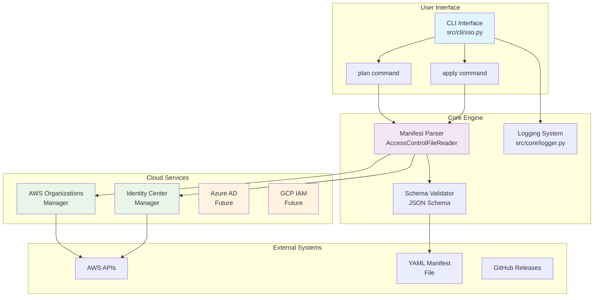
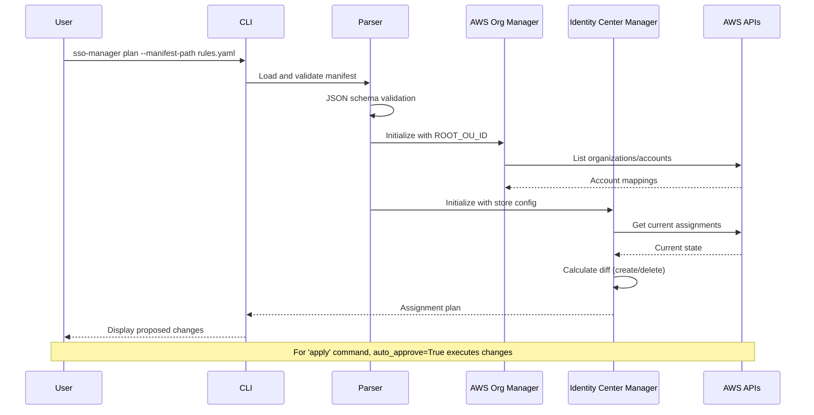
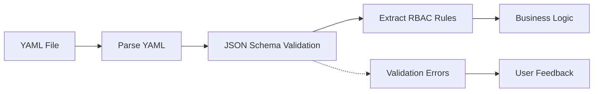
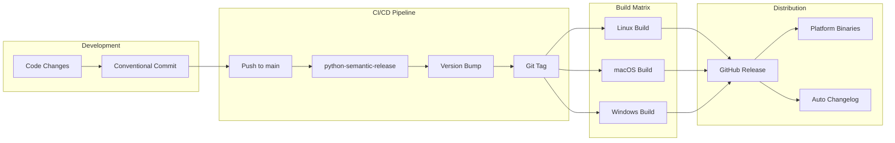
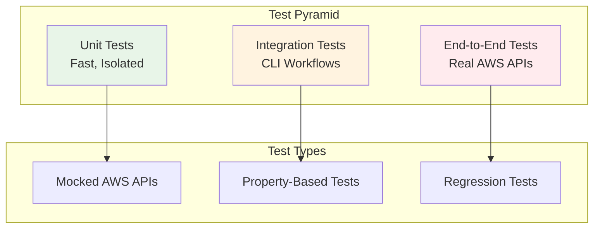
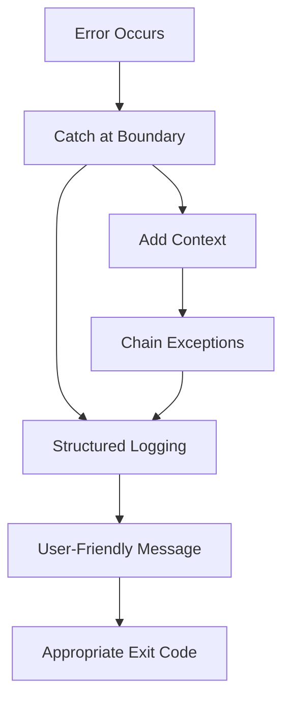
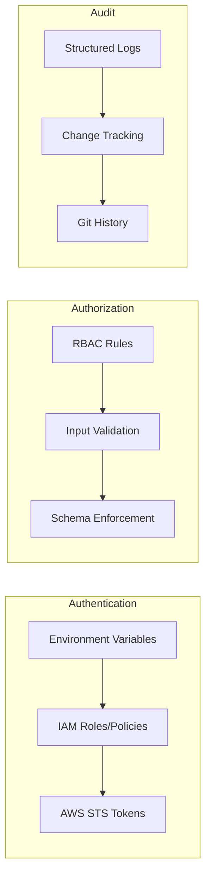
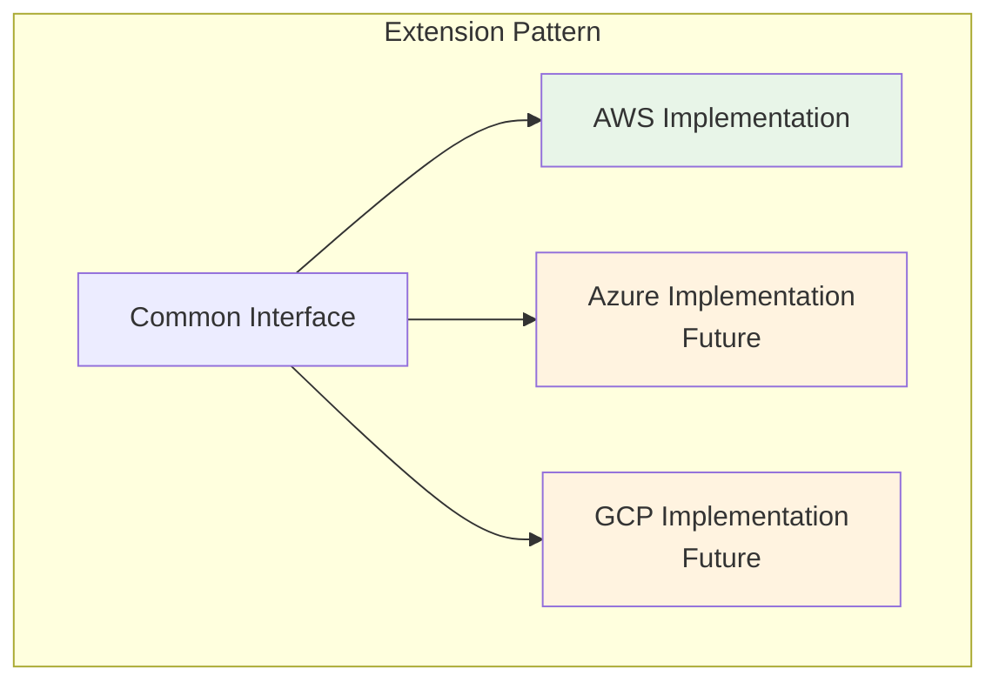

# Contributing to SSO Manager

We welcome contributions! This project demonstrates modern Python development practices and enterprise-grade software development.

## 🚀 Getting Started

### Prerequisites

- Python 3.13+
- Poetry for dependency management
- Docker for containerized development
- Make for build automation
- Git for version control

### Development Setup

1. **Fork the repository**
   ```bash
   # Fork on GitHub, then clone your fork
   git clone https://github.com/your-username/sso-manager.git
   cd sso-manager
   ```

2. **Set up development environment**
   ```bash
   # Start development environment with Docker
   make dev-env
   
   # Or install dependencies locally
   poetry install --with dev
   ```

3. **Verify setup**
   ```bash
   # Run tests
   make unittest
   
   # Run linting
   make format
   
   # Build binary
   make build
   ```

## 🛠️ Development Guidelines

### Code Quality Standards

1. **Follow PEP 8**: Use Python's official style guide
2. **Type Hints**: Add type hints to all functions and methods
3. **Docstrings**: Document all public functions, classes, and modules
4. **Test Coverage**: Maintain high test coverage for new code
5. **Error Handling**: Implement proper error handling and logging

### Code Style

```python
# Good example
def create_sso_assignments(
    manifest_path: str, 
    auto_approve: bool = False, 
    log_level: str = "INFO"
) -> Dict[str, Any]:
    """
    Process AWS SSO access management based on a manifest file.
    
    Args:
        manifest_path: Path to the SSO manifest file
        auto_approve: Flag to enable auto-approval mode
        log_level: Logging level for script execution
        
    Returns:
        Dictionary containing assignment results
        
    Raises:
        FileNotFoundError: If manifest file cannot be found
        ValueError: If manifest file fails validation
    """
    # Implementation here
    pass
```

### Testing

- **Unit Tests**: Write unit tests for all new functionality
- **Integration Tests**: Add integration tests for CLI workflows
- **Property-Based Tests**: Use property-based testing for complex logic
- **Test Naming**: Use descriptive test names that explain what is being tested

```python
def test_plan_command_calls_create_sso_assignments_with_auto_approve_false():
    """Test that plan command calls create_sso_assignments with auto_approve=False."""
    # Test implementation
    pass
```

### Documentation

- **README Updates**: Update README.md for new features
- **Docstrings**: Follow Google-style docstrings
- **Code Comments**: Add comments for complex logic
- **Examples**: Provide usage examples for new features

## 🔄 Development Workflow

### Branch Strategy

1. **Create a feature branch**
   ```bash
   git checkout -b feature/your-feature-name
   ```

2. **Make your changes**
   - Write code following the guidelines above
   - Add tests for new functionality
   - Update documentation as needed

3. **Test your changes**
   ```bash
   # Run all tests
   make unittest
   
   # Run linting and formatting
   make format
   
   # Test CLI functionality
   python -m src.cli.sso --help
   ```

4. **Commit your changes**
   ```bash
   # Use conventional commit messages
   git commit -m "feat: add new feature description"
   git commit -m "fix: resolve issue with specific component"
   git commit -m "docs: update documentation for feature"
   ```

### Commit Message Format

We use [Conventional Commits](https://www.conventionalcommits.org/) for automated releases:

- `feat:` - New features (minor version bump)
- `fix:` - Bug fixes (patch version bump)
- `docs:` - Documentation changes
- `style:` - Code style changes (formatting, etc.)
- `refactor:` - Code refactoring
- `test:` - Adding or updating tests
- `chore:` - Maintenance tasks (no release)

**Breaking changes**: Add `!` after type or include `BREAKING CHANGE:` in commit body for major version bumps.

### Pull Request Process

1. **Push your branch**
   ```bash
   git push origin feature/your-feature-name
   ```

2. **Create a Pull Request**
   - Use a descriptive title
   - Explain what changes you made and why
   - Reference any related issues
   - Include screenshots for UI changes

3. **Address Review Feedback**
   - Make requested changes
   - Push updates to your branch
   - Respond to reviewer comments

4. **Merge**
   - Once approved, your PR will be merged
   - Delete your feature branch after merge

## 🧪 Testing Guidelines

### Running Tests

```bash
# Run all tests with coverage
make unittest

# Run specific test file
poetry run pytest tests/unit/test_specific_file.py

# Run tests with verbose output
poetry run pytest -v

# Run tests in Docker environment
make dev-env
# Then inside container:
pytest
```

### Writing Tests

1. **Test Structure**: Use the Arrange-Act-Assert pattern
2. **Test Data**: Use fixtures for test data setup
3. **Mocking**: Mock external dependencies (AWS services, file system)
4. **Edge Cases**: Test error conditions and edge cases

```python
import pytest
from unittest.mock import patch, MagicMock

def test_create_sso_assignments_success():
    """Test successful SSO assignment creation."""
    # Arrange
    manifest_path = "test_manifest.yaml"
    expected_result = {"created": [], "deleted": [], "invalid": []}
    
    # Act
    with patch('src.cli.sso.AccessControlFileReader') as mock_reader:
        mock_reader.return_value.rbac_rules = []
        result = create_sso_assignments(manifest_path)
    
    # Assert
    assert result == expected_result
```

## 🏗️ Engineering Deep Dive

Understanding the engineering behind SSO Manager will help you contribute effectively. This section provides the technical context you need to hit the ground running.

### System Architecture Overview



### Data Flow Architecture



### Project Structure Deep Dive

```
sso-manager/
├── 📁 src/                          # Source code
│   ├── 📁 cli/                      # Command-line interface
│   │   └── 📄 sso.py               # Main CLI entry point & argument parsing
│   ├── 📁 core/                     # Core utilities and shared components
│   │   ├── 📄 access_control_file_reader.py  # YAML manifest parser & validator
│   │   ├── 📄 constants.py         # Application constants
│   │   ├── 📄 custom_classes.py    # Custom data structures
│   │   ├── 📄 logger.py            # Structured logging configuration
│   │   └── 📄 utils.py             # Utility functions
│   ├── 📁 services/                 # Cloud service integrations
│   │   └── 📁 aws/                 # AWS-specific implementations
│   │       ├── 📄 aws_identity_center_manager.py  # Identity Center operations
│   │       ├── 📄 aws_organizations_manager.py    # Organizations API wrapper
│   │       ├── 📄 exceptions.py    # AWS-specific exceptions
│   │       └── 📄 utils.py         # AWS utility functions
│   ├── 📁 schemas/                  # JSON schemas for validation
│   │   └── 📄 manifest_schema_definition.json    # YAML manifest schema
│   └── 📁 integrations/            # Future cloud provider integrations
├── 📁 tests/                        # Test suite
│   ├── 📁 unit/                    # Unit tests
│   ├── 📁 integration/             # Integration tests
│   └── 📁 manifests/               # Test manifest files
├── 📁 .github/workflows/           # CI/CD pipelines
├── 📄 sso-manager.spec            # PyInstaller build configuration
├── 📄 pyproject.toml              # Python project configuration
└── 📄 makefile                    # Build automation
```

### Core Components Explained

#### 1. CLI Interface Layer (`src/cli/sso.py`)

The CLI is the user-facing entry point that implements the plan/apply pattern:

```python
# Key responsibilities:
- Argument parsing with argparse
- Subcommand routing (plan vs apply)
- Environment variable validation
- Error handling and user feedback
- Version information display
```

**Key Design Decision**: The CLI is a thin layer that delegates to business logic, making it easy to test and maintain.

#### 2. Manifest Processing (`src/core/access_control_file_reader.py`)

Handles YAML manifest parsing and validation:



**Key Features**:
- JSON schema validation for early error detection
- Structured error reporting with line numbers
- Support for complex rule structures (users, groups, OUs, accounts)

#### 3. AWS Service Managers

Two specialized managers handle AWS API interactions:

**Organizations Manager** (`aws_organizations_manager.py`):
```python
# Responsibilities:
- Map organizational units to account IDs
- Traverse AWS Organizations hierarchy
- Cache account mappings for performance
- Handle AWS API pagination and rate limiting
```

**Identity Center Manager** (`aws_identity_center_manager.py`):
```python
# Responsibilities:
- Get current SSO assignments
- Calculate assignment diffs (create/delete)
- Execute assignment changes (apply mode)
- Handle assignment conflicts and errors
```

### Build & Release Engineering



#### PyInstaller Configuration

The `sso-manager.spec` file defines how Python code becomes a standalone binary:

```python
# Key configurations:
- Entry point: src/cli/sso.py
- Hidden imports: AWS SDK modules that PyInstaller might miss
- Data files: JSON schemas bundled into the binary
- Single-file output: Everything packaged into one executable
```

#### Semantic Release Automation

Uses conventional commits to automate versioning:

```bash
feat: new feature     → Minor version bump (1.0.0 → 1.1.0)
fix: bug fix         → Patch version bump (1.0.0 → 1.0.1)
feat!: breaking      → Major version bump (1.0.0 → 2.0.0)
chore: maintenance   → No version bump
```

### Testing Strategy



#### Testing Approach

1. **Unit Tests**: Fast, isolated tests with mocked dependencies
2. **Integration Tests**: Test CLI workflows end-to-end
3. **Property-Based Tests**: Test universal properties across input ranges
4. **Regression Tests**: Ensure backward compatibility

### Error Handling Philosophy



**Key Principles**:
- Catch errors at service boundaries
- Provide actionable error messages
- Use structured logging for debugging
- Return appropriate exit codes for automation

### Performance Considerations

#### AWS API Optimization

```python
# Strategies used:
- Pagination handling for large organizations
- Concurrent API calls where possible
- Caching of organization mappings
- Rate limiting respect and backoff
```

#### Memory Management

```python
# For large organizations:
- Stream processing of large datasets
- Lazy loading of AWS resources
- Efficient data structures for mappings
- Garbage collection considerations in long-running operations
```

### Security Design



**Security Features**:
- No hardcoded credentials (environment variables only)
- Input validation with JSON schemas
- Structured audit logging
- Git-based change tracking
- Principle of least privilege for AWS permissions

### Extension Points for New Contributors

#### Adding New Cloud Providers



**Implementation Steps**:
1. Create new service module: `src/services/azure/`
2. Implement common interface patterns
3. Add provider-specific configuration
4. Update CLI to support new provider
5. Add comprehensive tests

#### Common Extension Points

- **New CLI Commands**: Add to `src/cli/sso.py`
- **New Validation Rules**: Extend JSON schema
- **New Output Formats**: Add formatters to core utilities
- **New Authentication Methods**: Extend service managers
- **New Logging Destinations**: Extend logging configuration

This architecture provides a solid foundation for multi-cloud expansion while maintaining clean separation of concerns and testability.

### Adding New Cloud Providers

When adding support for new cloud providers (Azure, GCP):

1. Create new service module: `src/services/azure/` or `src/services/gcp/`
2. Implement consistent interface patterns
3. Add comprehensive tests
4. Update documentation and examples
5. Follow the same patterns as AWS implementation

## 🐛 Bug Reports

### Before Submitting

1. **Search existing issues** to avoid duplicates
2. **Test with latest version** to ensure bug still exists
3. **Gather information** about your environment

### Bug Report Template

```markdown
**Describe the bug**
A clear description of what the bug is.

**To Reproduce**
Steps to reproduce the behavior:
1. Run command '...'
2. With manifest file '...'
3. See error

**Expected behavior**
What you expected to happen.

**Environment:**
- OS: [e.g., macOS, Linux, Windows]
- Python version: [e.g., 3.13]
- SSO Manager version: [e.g., 1.0.0]

**Additional context**
Add any other context about the problem here.
```

## 💡 Feature Requests

### Before Submitting

1. **Check the roadmap** to see if it's already planned
2. **Search existing issues** for similar requests
3. **Consider the scope** - does it fit the project's goals?

### Feature Request Template

```markdown
**Is your feature request related to a problem?**
A clear description of what the problem is.

**Describe the solution you'd like**
A clear description of what you want to happen.

**Describe alternatives you've considered**
Other solutions or features you've considered.

**Additional context**
Add any other context or screenshots about the feature request.
```

## 📋 Release Process

Releases are automated using semantic-release:

1. **Merge to main** triggers the release workflow
2. **Conventional commits** determine version bump
3. **GitHub release** is created automatically
4. **Binaries** are built for all platforms
5. **Changelog** is generated automatically

## 🤝 Community

- **Be respectful** and inclusive in all interactions
- **Help others** learn and contribute
- **Share knowledge** through documentation and examples
- **Follow the code of conduct** (coming soon)

## 📞 Getting Help

- **GitHub Issues**: For bugs and feature requests
- **GitHub Discussions**: For questions and general discussion
- **Documentation**: Check README.md and code comments

Thank you for contributing to SSO Manager! 🎉