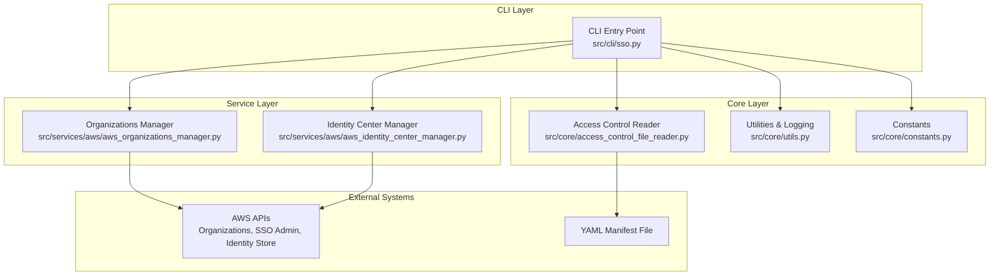
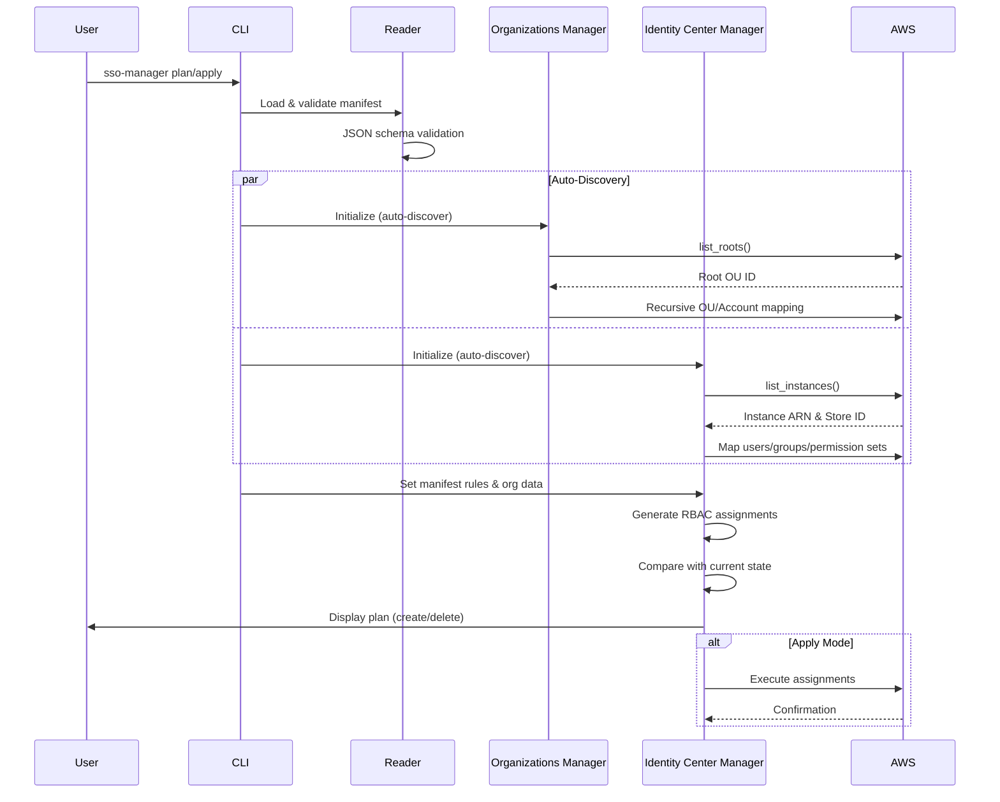
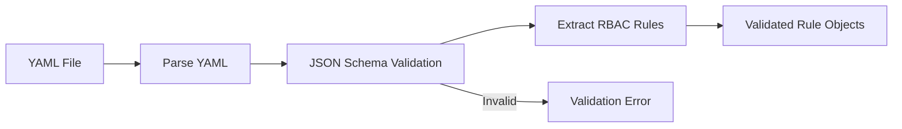
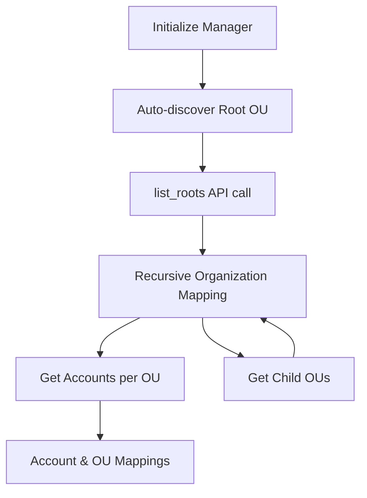
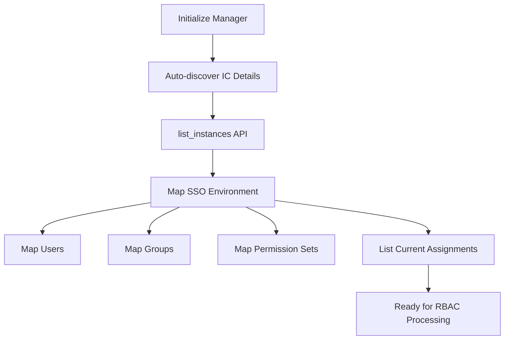
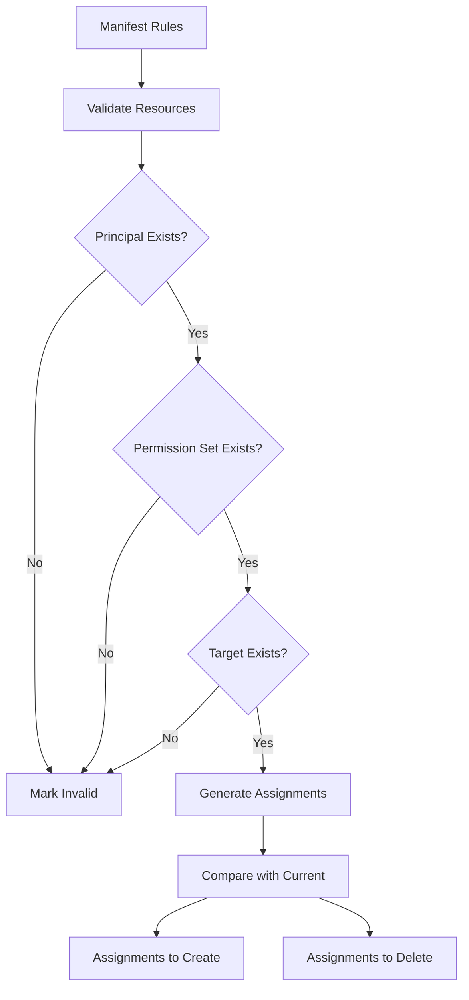
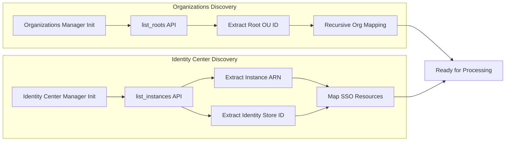
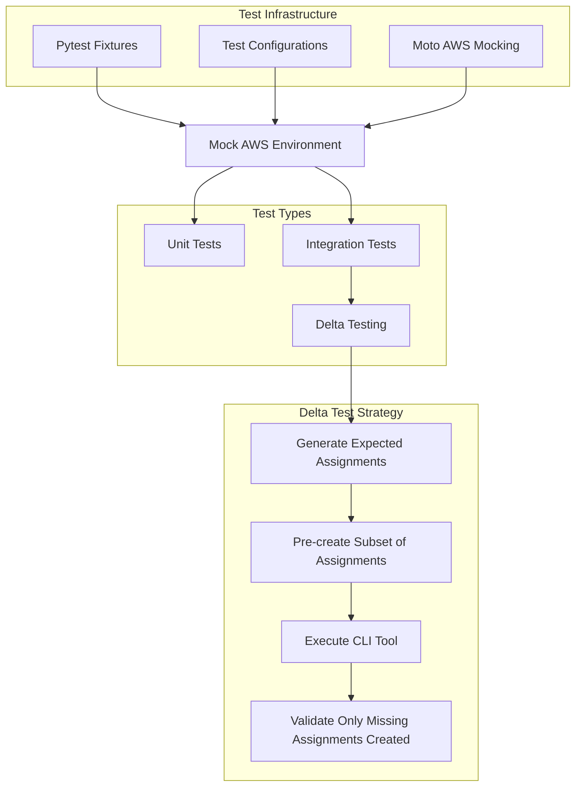

[](https://github.com/permia-cloud-security/sso-manager/actions/workflows/testing.yaml)
[](https://github.com/permia-cloud-security/sso-manager/actions/workflows/linting.yaml)
[](https://github.com/permia-cloud-security/sso-manager/actions/workflows/scanning.yaml)
[](https://codecov.io/github/islamelkadi/sso-entitlements-manager)

# SSO Manager - Multi-Cloud Access Management Tool

> **Infrastructure-as-code access management for AWS, Azure, and Google Cloud Platform**

A modern CLI tool that transforms multi-cloud access control management using infrastructure-as-code patterns with plan/apply workflows. Built for enterprise environments requiring transparency, traceability, and automated access management across cloud platforms.

## 🚀 Quick Start

### Installation

#### Binary Download (Recommended)
Download the latest binary for your platform from the [releases page](https://github.com/permia-cloud-security/sso-manager/releases):

```bash
# Linux
curl -L https://github.com/permia-cloud-security/sso-manager/releases/latest/download/sso-manager-linux -o sso-manager
chmod +x sso-manager

# macOS
curl -L https://github.com/permia-cloud-security/sso-manager/releases/latest/download/sso-manager-macos -o sso-manager
chmod +x sso-manager

# Windows
# Download sso-manager-windows.exe from releases page
```

#### From Source
```bash
git clone https://github.com/permia-cloud-security/sso-manager.git
cd sso-manager
make build
```

### Usage

The tool follows infrastructure-as-code patterns with plan/apply commands:

```bash
# Show proposed access changes without executing them
sso-manager plan --manifest-path ./access-rules.yaml --log-level INFO

# Execute the proposed access changes
sso-manager apply --manifest-path ./access-rules.yaml --log-level INFO
```

### AWS Setup

The tool automatically discovers required AWS resources:
- **AWS Organizations Root OU ID** - Auto-discovered from your AWS Organizations setup
- **AWS Identity Center Details** - Auto-discovered from your Identity Center instance

**Prerequisites:**
- AWS CLI configured with appropriate credentials
- AWS Organizations enabled in your account
- AWS Identity Center (SSO) enabled and configured
- Required IAM permissions for Organizations and Identity Center access

## 📋 Table of Contents

1. [Overview & Background](#overview--background)
2. [Key Features](#key-features)
3. [Architecture](#architecture)
4. [Configuration](#configuration)
5. [Technical Depth](#technical-depth)
6. [Development](#development)
7. [Roadmap](#roadmap)
8. [Contributing](#contributing)

## 🎯 Overview & Background

### The Multi-Cloud Access Challenge

In today's multi-cloud environment, organizations face significant challenges in managing access control at scale, particularly when implementing Single Sign-On (SSO) solutions. With numerous employees requiring access across AWS, Azure, and Google Cloud Platform through centralized authentication systems, the complexity of permission management has increased exponentially.

This challenge is particularly critical given the current threat landscape, where broken access control consistently ranks as the top security vulnerability in the OWASP Top 10. Many organizations rely on system administrators to create IAM roles and policies, granting access to users and groups typically synchronized from their SSO identity providers. However, this process, often executed through non-reproducible means such as manual console operations or CLI commands, lacks transparency and traceability, leaving organizations vulnerable to security risks and compliance issues.

### The Problem We Solve

Current multi-cloud access control management lacks the necessary transparency, traceability, and audibility. While SSO simplifies user authentication, organizations still struggle to answer fundamental questions about access provisioning within their cloud environments:

- **Who made access decisions and why?**
- **When were access provisions granted or revoked?**
- **How can we audit and track all access changes?**
- **Can we reproduce access configurations across environments?**

This lack of visibility, transparency, traceability and non-reproducibility, even in SSO-enabled environments, not only hampers effective security management but also exposes organizations to potential compliance violations and increased security risks, undermining some of the key benefits that SSO aims to provide.

### Our Solution: Infrastructure-as-Code for Access Management

SSO Manager transforms access control management from an opaque, manual process into a transparent, traceable, and automated system. Our git-based approach with centralized configuration offers:

1. **Infrastructure-as-Code**: Declarative YAML configuration for all access rules
2. **Plan/Apply Workflow**: Review changes before execution, similar to Terraform
3. **Git-Based Traceability**: Full version control and audit trails through commit history
4. **Multi-Cloud Ready**: Currently supports AWS, designed for Azure and GCP expansion
5. **Enterprise Integration**: Webhook support for existing workflows and project management systems
6. **Unified Control**: Single control panel for managing access across multiple cloud vendors
7. **Enhanced Transparency**: Commit messages and committer IDs provide clear insights into who made changes, when, and why
8. **Reproducibility**: Configuration-as-code approach makes all changes reproducible across environments
9. **Security Tool Integration**: Compatible with SIEM tools for enhanced security posture

This solution significantly reduces security risks and improves operational efficiency in multi-cloud environments while providing the audit trails crucial for compliance and security reviews.

### Related Work

Similar solutions addressing multi-cloud access management:

- [Manage permission sets and account assignments in AWS IAM Identity Center with a CI/CD pipeline](https://aws.amazon.com/blogs/infrastructure-and-automation/manage-permission-sets-and-account-assignments-in-aws-iam-identity-center-with-a-ci-cd-pipeline/)

## 🌟 Key Features

- **Auto-Discovery**: Automatically discovers AWS Organizations and Identity Center resources
- **Plan/Apply Commands**: Infrastructure-as-code workflow for access management
- **Multi-Cloud Architecture**: Currently supports AWS, designed for Azure and GCP
- **Enterprise CLI**: Enterprise-grade command-line interface with comprehensive help
- **Binary Distribution**: Standalone executables for all major platforms
- **Automated Releases**: Semantic versioning with automated GitHub releases
- **Comprehensive Logging**: Configurable log levels for detailed execution tracking
- **Zero Configuration**: No manual environment variable setup required

## 🏗️ Architecture

### Current Implementation (AWS)
```
Manifest File → SSO Manager → AWS Organizations → Identity Center Assignments
     ↓              ↓              ↓                    ↓
  YAML Rules    Plan/Apply    Auto-Discovery      Permission Sets
                              Account Mapping
```

### Multi-Cloud Vision
```
                    ┌─── AWS Organizations ───┐
Manifest File ──→ SSO Manager ──┼─── Azure AD ──────────┼──→ Unified Access Control
                    └─── GCP IAM ─────────────┘
```

## ⚙️ Configuration

### Manifest File Structure

Create a YAML manifest file defining your access rules:

```yaml
rules:
  - rule_type: "allow"
    principal_type: "user"
    principal_name: "john.doe@company.com"
    permission_set_name: "ReadOnlyAccess"
    target_type: "account"
    target_name: "production-account"
    
  - rule_type: "allow"
    principal_type: "group"
    principal_name: "DevOps-Team"
    permission_set_name: "PowerUserAccess"
    target_type: "ou"
    target_name: "development-ou"
```

### Advanced Configuration

The tool supports complex access patterns:
- User and group-based assignments
- Account and Organizational Unit targeting
- Multiple permission set mappings
- Conditional access rules

## 🛠️ Development

### Prerequisites

- Python 3.13+
- Poetry for dependency management
- Docker for containerized development
- Make for build automation

### Development Setup

```bash
# Clone the repository
git clone https://github.com/permia-cloud-security/sso-manager.git
cd sso-manager

# Install development dependencies
make install-dev

# Start development environment
make dev-env

# Run tests
make unittest

# Format and lint code
make format

# Build binary
make build
```

### Build System

The project uses a modern Python build pipeline:
- **Poetry**: Python dependency management and packaging
- **PyInstaller**: Binary executable creation using `sso-manager.spec` configuration
- **python-semantic-release**: Automated GitHub releases and tagging
- **GitHub Actions**: Automated CI/CD pipeline

#### PyInstaller Configuration

The `sso-manager.spec` file is PyInstaller's configuration file that defines how to build the standalone executable:

```python
# sso-manager.spec - PyInstaller build configuration
a = Analysis(
    ['src/cli/sso.py'],           # Entry point script
    pathex=['.'],                 # Search paths
    datas=[                       # Include data files
        ('src/schemas/*.json', 'schemas'),
    ],
    hiddenimports=[               # Modules not auto-detected
        'boto3', 'botocore', 'yaml', 'jsonschema', 'rich'
    ],
    # ... other configuration
)
```

**What the .spec file does:**
- **Entry Point**: Specifies `src/cli/sso.py` as the main script
- **Dependencies**: Lists hidden imports that PyInstaller might miss
- **Data Files**: Includes JSON schema files needed at runtime
- **Build Options**: Configures single-file executable creation

This is the standard approach for PyInstaller - while not "pure Python," it's the industry-accepted method for creating standalone Python executables.

#### Simplified Version Management

The project uses a simplified approach to versioning:
- **CLI Version**: Points users to GitHub releases page for version information
- **GitHub Releases**: Automated releases with semantic versioning (v1.0.0, v1.1.0, etc.)
- **No Code Complexity**: No version parsing or complex version management in the codebase

### Testing

```bash
# Run unit tests with coverage
make unittest

# Run linting
make format

# Clean build artifacts
make clean-all
```

## 🗺️ Roadmap

### Phase 1: AWS Foundation ✅
- [x] AWS Organizations integration
- [x] Identity Center management
- [x] Plan/apply workflow
- [x] Binary distribution
- [x] Auto-discovery of AWS resources

### Phase 2: Multi-Cloud Expansion 🚧
- [ ] **Microsoft Azure Integration**
  - Azure Active Directory support
  - Azure subscription management
  - Role-based access control (RBAC)
  
- [ ] **Google Cloud Platform Integration**
  - GCP IAM integration
  - Project and organization management
  - Service account automation

## 🔧 Technical Depth

### Repository Structure

The project follows a clean, modular architecture with clear separation of concerns:

```
sso-entitlements-manager/
├── 📁 src/                         # Source code
│   ├── 📄 __init__.py              # Package initialization
│   ├── 📁 cli/                     # Command-line interface
│   │   └── 📄 sso.py               # Main CLI entry point with typer
│   ├── 📁 core/                    # Core business logic
│   │   ├── 📄 access_control_file_reader.py  # YAML manifest parser & validator
│   │   ├── 📄 constants.py         # Application constants
│   │   ├── 📄 custom_classes.py    # Data classes for AWS resources
│   │   ├── 📄 logger.py            # Structured logging configuration
│   │   └── 📄 utils.py             # Utility functions
│   ├── 📁 services/                # Cloud service integrations
│   │   └── 📁 aws/                 # AWS-specific implementations
│   │       ├── 📄 aws_identity_center_manager.py  # Identity Center operations
│   │       ├── 📄 aws_organizations_manager.py    # Organizations API wrapper
│   │       ├── 📄 exceptions.py    # AWS-specific exceptions
│   │       └── 📄 utils.py         # AWS utility functions
│   └── 📁 schemas/                 # JSON schemas for validation
│       └── 📄 manifest_schema_definition.json    # YAML manifest schema
├── 📁 tests/                       # Test suite
│   ├── 📁 unit/                    # Unit tests
│   │   ├── 📄 test_access_control_file_reader.py
│   │   ├── 📄 test_aws_identity_center_manager.py
│   │   ├── 📄 test_organizations_manager.py
│   │   └── 📄 test_utils.py
│   ├── 📁 integration/             # Integration tests
│   │   └── 📄 test_cli.py          # End-to-end CLI testing
│   ├── 📁 configs/                 # Test configurations
│   │   └── 📁 organizations/       # Sample AWS org structures
│   ├── 📁 manifests/               # Test manifest files
│   │   ├── 📁 valid_schema/        # Valid YAML manifests
│   │   └── 📁 invalid_schema/      # Invalid manifests for error testing
│   ├── 📄 conftest.py              # Pytest configuration & fixtures
│   └── 📄 utils.py                 # Test utilities
├── 📁 logging/                     # Logging configuration
│   ├── 📁 configs/                 # Log configuration files
│   └── 📁 logs/                    # Runtime log files
├── 📁 .github/                     # GitHub Actions workflows
│   └── 📁 workflows/               # CI/CD pipeline definitions
├── 📄 sso-manager.spec             # PyInstaller build configuration
├── 📄 pyproject.toml               # Python project configuration
├── 📄 makefile                     # Development automation
├── 📄 Dockerfile                   # Container configuration
├── 📄 .pre-commit-config.yaml      # Pre-commit hooks
├── 📄 .pylintrc                    # Python linting configuration
└── 📄 README.md                    # Project documentation
```

**Key Directory Purposes:**

- **`src/cli/`** - User-facing command-line interface built with typer
- **`src/core/`** - Business logic, data models, and utilities independent of cloud providers
- **`src/services/aws/`** - AWS-specific service implementations (future: `azure/`, `gcp/`)
- **`src/schemas/`** - JSON schemas for validating YAML manifest files
- **`tests/unit/`** - Fast, isolated tests for individual components
- **`tests/integration/`** - End-to-end tests with mocked AWS services
- **`tests/configs/`** - Sample AWS organization structures for testing
- **`tests/manifests/`** - Test YAML files covering valid and invalid scenarios
- **`logging/`** - Centralized logging configuration and runtime logs
- **`.github/workflows/`** - Automated CI/CD pipeline for testing, linting, and releases

**Design Principles:**

- **Separation of Concerns** - CLI, core logic, and cloud services are clearly separated
- **Testability** - Each layer can be tested independently with appropriate mocks
- **Extensibility** - New cloud providers can be added under `src/services/`
- **Configuration as Code** - All settings managed through version-controlled files
- **Zero Configuration** - Auto-discovery eliminates manual environment setup

### System Architecture Overview

The SSO Manager follows a layered architecture pattern with clear separation of concerns:



### Data Flow Architecture

The system processes access control rules through a well-defined pipeline:



### Core Components Deep Dive

#### 1. CLI Entry Point (`src/cli/sso.py`)

**Purpose**: Orchestrates the entire workflow and provides the user interface.

**Key Functions**:
- `create_sso_assignments()`: Main orchestration function
- `execute_plan()` / `execute_apply()`: Command handlers
- Argument parsing and validation

**Auto-Discovery Integration**:
```python
# No environment variables needed - classes auto-discover
aws_organization_manager = AwsOrganizationsManager()
identity_center_manager = IdentityCenterManager()
```

#### 2. Access Control File Reader (`src/core/access_control_file_reader.py`)

**Purpose**: Validates and parses YAML manifest files containing access rules.

**Validation Flow**:


**Rule Structure**:
```yaml
rules:
  - rule_type: "allow"           # Rule type (currently only "allow")
    principal_type: "user"       # "user" or "group"
    principal_name: "john.doe"   # SSO username or group name
    permission_set_name: "ReadOnly" # Permission set to assign
    target_type: "account"       # "account" or "ou"
    target_names: ["prod-account"] # List of target names
```

#### 3. Organizations Manager (`src/services/aws/aws_organizations_manager.py`)

**Purpose**: Maps AWS Organizations structure and provides account/OU relationships.

**Auto-Discovery Process**:


**Key Data Structures**:
```python
# Account mapping: name -> ID
accounts_name_id_map = {
    "production-account": "123456789012",
    "development-account": "210987654321"
}

# OU mapping: OU name -> list of accounts
ou_accounts_map = {
    "root": [AwsAccount(Id="123...", Name="prod-account")],
    "development": [AwsAccount(Id="210...", Name="dev-account")]
}
```

#### 4. Identity Center Manager (`src/services/aws/aws_identity_center_manager.py`)

**Purpose**: Manages SSO users, groups, permission sets, and account assignments.

**Initialization Flow**:


**RBAC Assignment Generation**:


### AWS Resource Auto-Discovery

The system automatically discovers required AWS resources without manual configuration:



### Testing Architecture

The project uses a comprehensive testing strategy with mocked AWS services and sophisticated delta testing:



#### Delta Testing Approach

The integration tests use a sophisticated **delta testing strategy** to simulate real-world scenarios and validate state management:

**Pre-Test Assignment Percentages**: Tests run with different percentages (0%, 20%, 40%, 60%, 80%, 100%) of assignments already created:

```python
PRE_TEST_ACCOUNT_ASSIGNMENT_PERCENTAGES = [
    round(i * 0.2, 2) for i in range(6)  # [0.0, 0.2, 0.4, 0.6, 0.8, 1.0]
]
```

**State Management Simulation**:
This approach simulates various real-world deployment states:
- **Fresh Environment** (0%) - New AWS organization with no existing assignments
- **Partial Deployments** (20%-80%) - Environments where previous runs were interrupted or partial
- **Fully Deployed** (100%) - Mature environments where all assignments already exist

**Test Flow**:
1. **Generate Expected Assignments** - Calculate all assignments that should exist based on manifest
2. **Pre-create Subset** - Create a percentage of those assignments to simulate existing state
3. **Execute Tool** - Run the SSO manager against the partially-assigned environment
4. **Validate Delta** - Verify only the missing assignments were created, not duplicates

**Example Scenario**:
- Manifest defines 100 total assignments needed
- Test runs with 40% pre-existing assignments (simulating partial deployment)
- Tool should create exactly 60 new assignments (the delta)
- Validates tool doesn't duplicate existing assignments

This comprehensive simulation ensures the tool correctly:
- **Detects existing assignments** - Reads current AWS state accurately
- **Calculates deltas** - Determines what changes are actually needed
- **Maintains idempotency** - Safe to run multiple times without side effects
- **Handles edge cases** - Works in fresh (0%) and fully-deployed (100%) scenarios
- **Validates state management** - Ensures the tool's internal state tracking matches AWS reality

## 🤝 Contributing

See [CONTRIBUTING.md](CONTRIBUTING.md) for detailed contribution guidelines.

## 📄 License

This project is licensed under the MIT License - see the [LICENSE](LICENSE) file for details.